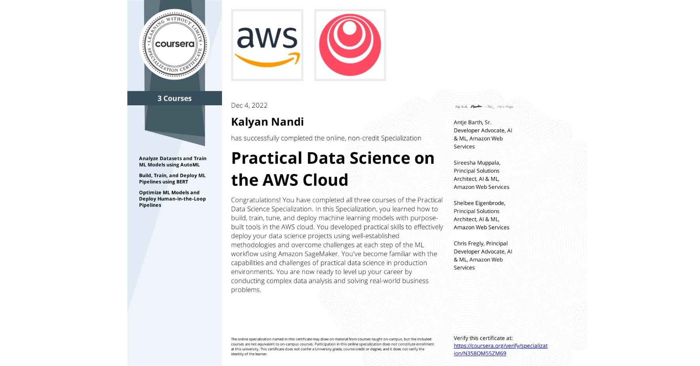

# Lab Solutions on Practical Data Science Specialization

Access the courses in the Coursera [Practical Data Science Specialization](https://www.coursera.org/specializations/practical-data-science) Specialization offered by `deeplearning.ai`.

<!-- {width=50%} -->

The solutions here are **ONLY FOR REFERENCE** to guide you if you get stuck somewhere. 